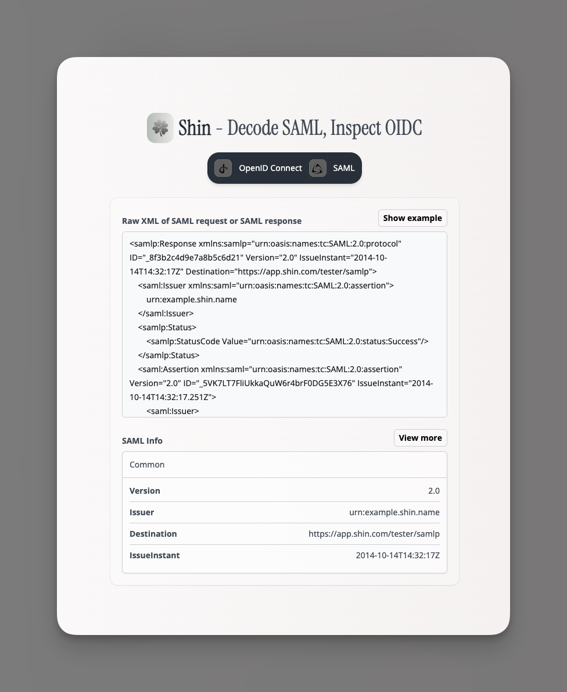

# Shin Playground

🍀 A UI playground to utilize the auth utilities from [`shin-auth`](https://github.com/LauraBeatris/shin) package.

  

### Features on top of `shin-auth`

- Decode SAML responses & SAML requests
- Validate and parse OIDC provider configuration

## Development

* Run `mix setup` to install and setup dependencies
* Start Phoenix endpoint with `mix phx.server` or inside IEx with `iex -S mix phx.server`

Now you can visit [`localhost:4000`](http://localhost:4000) from your browser.

